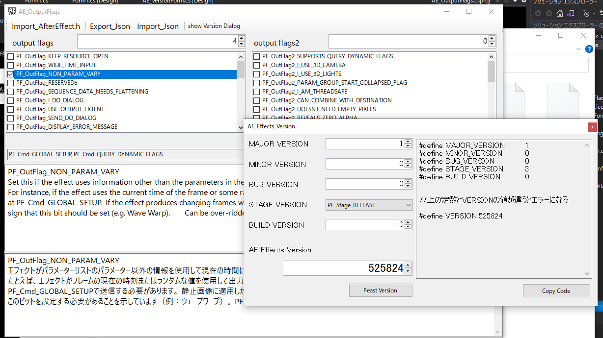

# AE_sdk_util
After Effects SDKで必要な**Output Flags**と**Version**を計算するアプリです。

.Net core5にプラットフォームを変えました。
AE2020以降にも対応できるようにしました。
**Import_AE_EffectH**で、**AE_Effect.ｈ**を読み込んで使用します。

## Usage
特に説明しなく大丈夫と思います。
  **AE_Version**は**show Version Dialog**から表示させます。

## License
This software is released under the MIT License, see LICENSE.

## Authors

bry-ful(Hiroshi Furuhashi)
twitter:[bryful](https://twitter.com/bryful)
bryful@gmail.com

# References
